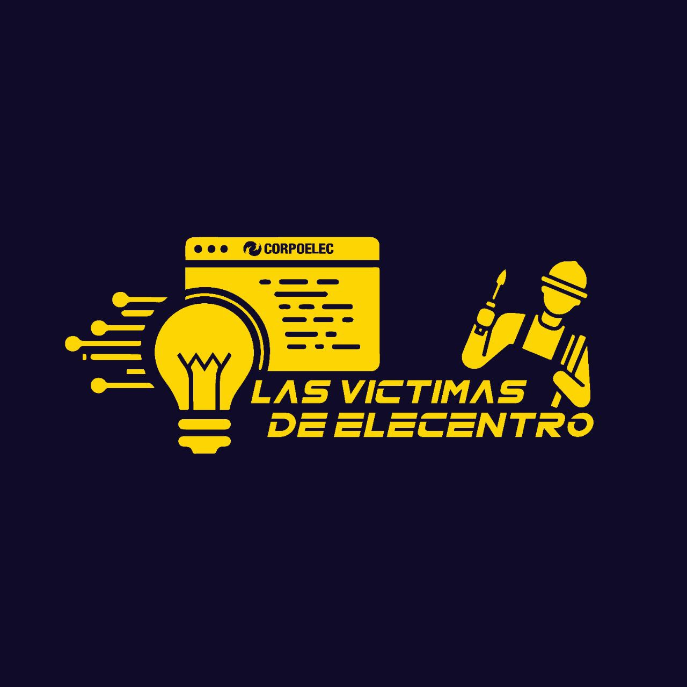
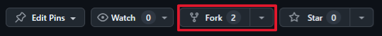
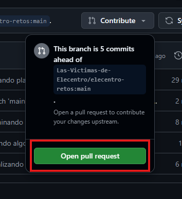

<div align="center">
  
  <h1>Retos de programacion de Las Victimas de Elecentro</h1>
</div>

¡Víctimas de Elecentro!

Los invitamos a embarcarse en una aventura que transformará su manera de pensar y los llevará a ser verdaderas CABRAS del código. ¿Por qué conformarse con ser buenos cuando pueden ser los mejores?

El camino comienza aprendiendo un lenguaje de programación desde cero y dominándolo semana a semana con ejercicios cada vez más desafiantes. Cada reto pondrá a prueba su lógica y creatividad, fortaleciendo su mente para resolver problemas reales.

No se trata solo de memorizar código, sino de entender, experimentar, equivocarse y mejorar. La mentalidad GOAT es constancia, resiliencia y ganas de superarse. Con cada línea de código, estarán construyendo su propio camino hacia la maestría.

Recuerden: las cabras se hacen trabajando duro y enfrentando dificultades. La progresión semanal les dará estructura y motivación para avanzar hacia la cima.

Prepárense, porque está por comenzar su transformación. ¡Vamos a codear, crecer y convertirnos en las CABRAS indiscutibles de la programación!

¿Listos para ser leyendas? ¡Demos el primer paso juntos!

## Guia para contribuir a los ejercicios
Para contribuir a los ejercicios, sigue estos pasos:

1. **Haz un fork del repositorio**  
  Haz clic en el botón de fork para crear una copia en tu cuenta de GitHub. Está arriba:
  

2. **Clona tu fork en tu computadora**  
  Puedes hacerlo desde VSCode (usando la pantalla de bienvenida, la paleta de comandos, o la integración de Git) o desde la terminal con el siguiente comando:

  ```bash
  git clone https://github.com/TU_USUARIO/elecentro-retos.git
  ```

  Asegúrate de clonar **tu fork**, no el repositorio original.

3. **Realiza tus cambios**  
  Edita los archivos y resuelve los ejercicios. Cuando termines, guarda los cambios con un commit:

  ```bash
  git add .
  git commit -m "Agrego mi solución al reto X"
  ```

  También puedes usar la interfaz gráfica de VSCode por si no te gusta la terminal 😉

4. **Sincroniza tus cambios con GitHub**  
  Haz push para subir tus cambios a tu fork:

  ```bash
  git push
  ```

  O usa la interfaz gráfica de VSCode. Como prefieras ✨

5. **Envía tu Pull Request (PR)**  
  Ve al tu repo (el de tu fork) en GitHub. Haz clic en **Contribute** y selecciona **Open pull request**. Describe brevemente tus cambios y envía la PR para que sea revisada.
  

---

## Consejos adicionales

- Si tienes dudas, pregunta. Somos un equipo y entre todos nos apoyamos.
- No temas equivocarte: cada error es una oportunidad para aprender.
- Sé claro en tus commits y PRs, así será más fácil revisar tu aporte.

---

¡Gracias por contribuir! Juntos, vamos a crecer como programadores y a convertirnos en verdaderas CABRAS del código.
Ve a la página original del repositorio en GitHub. Allí, haz clic en el botón **Contribute** y luego selecciona **Open pull request** para enviar tus cambios y que puedan ser revisados e integrados en el repositorio principal.

