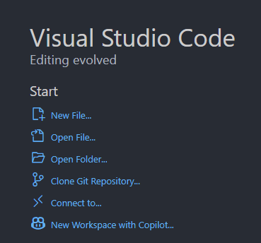
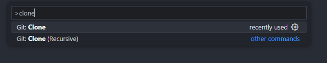
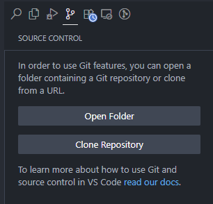

# Retos de programacion de Las Victimas de Elecentro

¡Víctimas de Elecentro!

Hoy los invitamos a embarcarse en una aventura que no solo transformará su manera de pensar, sino que los llevará a ser las verdaderas CABRAS del código (los más duros de los duros entre los duros). ¿Por qué conformarse con ser buenos cuando pueden ser los mejores?

El camino hacia la grandeza comienza con un solo paso: aprender un lenguaje de programación desde cero y dominarlo semana a semana a través de ejercicios que, poco a poco, se vuelven más desafiantes. Cada reto semanal no solo pondrá a prueba su lógica y creatividad, sino que fortalecerá su mente para resolver problemas complejos y reales.

No se trata solo de memorizar códigos, sino de entender, experimentar, equivocarse y mejorar. Esa es la mentalidad de un verdadero GOAT: la constancia, la resiliencia y el hambre de superarse. Con cada línea de código que escriban, estarán construyendo no solo programas, sino su propio camino hacia la maestría.

Recuerden: las cabras no nacen sino que se hacen, y se hacen trabajando duro, enfrentando dificultades y nunca dejando de avanzar. La progresión semanal les dará la estructura y la motivación para que cada dificultad sea un peldaño más hacia la cima.

Así que prepárense, porque está a punto de comenzar su transformación. ¡Vamos a codear, a crecer y a convertirnos en las CABRAS indiscutibles de la programación!

¿Están listos para ser leyendas? ¡Entonces demos el primer paso juntos!

## Guia para contribuir a los ejercicios

Lo primero es hacer un fork de este repositorio dando click en el siguiente botón. Esto creará una copia del repo en tu cuenta de GitHub.

A partir de aqui debes clonar el repo en tu compu para poder editarlo en local. A continuación explicaré dos métodos, uno con VSCode y otro con la terminal.

### Con VSCode

Abre Visual Studio Code (VSCode). Puedes clonar un repo desde la pantalla de bienvenida:

O utilizar la paleta de comandos con `ctrl+shift+tab`:

O incluso desde la integracion con Git del editor:

Recuerda que debes clonar el fork que está en tu cuenta, no el repo original. Para Ric el viejo sería así, por ejemplo: https://github.com/RicJDev/elecentro-retos

Cuando termines, guarda los cambios haciendo **commit**.

Sincroniza los cambios con tu repositorio en GitHub usando **push** (o "sincronizar cambios" en VSCode).

### Con la terminal (altos hackers 😎)

### Haciendo la PR

Ve a la página original del repositorio en GitHub. Allí, haz clic en el botón **Contribute** y luego selecciona **Open pull request** para enviar tus cambios y que puedan ser revisados e integrados en el repositorio principal.

